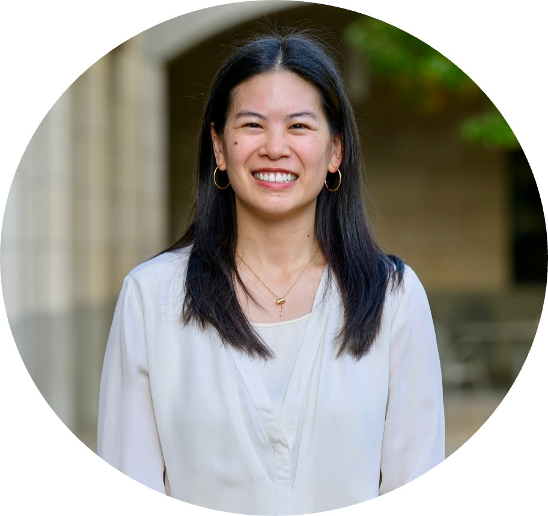

<html>
  <head>
    <meta name="viewport" content="width=device-width, initial-scale=1.0">
    <link rel="stylesheet" type="text/css" href="CSS/style.css">
  </head>
  <body>
    

      <a href="cv/Wu_Katherine_CV.pdf">cv</a>
      <a href="https://kjw58.github.io/katiewu.github.io/">about</a>
      <h1>Katie Wu</h1>
    

    

      

        
        <ul>
          
PhD Student @ Stanford, Emmett Interdisciplinary Program in Environment and Resources (E-IPER); researches urban ecology, health and well-being, and climate resilience 

          <li><a href="https://eiper.stanford.edu/people/katie-wu">Stanford Profile</a></li>
          <li><a href="https://www.linkedin.com/in/katiewu24/">
            
            LinkedIn
          </a></li>
            <li><a href="https://github.com/kjw58">
            
            GitHub
          </a></li>
          <li><a href="mailto:katwu@stanford.edu">
            
            Email
          </a></li>
        </ul>
      

    

    <main class="main-content">
      
My research uses large-scale data analysis and AI to monitor how infrastructure development impacts human and planetary health in an urban context. My focus is on optimizing cities to improve social connectedness and well-being for climate resilience. I employ a variety of unconventional data sources, including satellite imagery, citizen-sourced data, and social media content to model the built and natural environment for geographical locations with limited conventional data. 
 
      
I'm a Dean's Graduate Scholar in the Doerr School of Sustainability and a Stanford Dalai Lama Fellow. Prior to Stanford, I studied data science and AI for Product Innovation at Duke University where I obtained a Master of Engineering Management. I was a Sustainability Graduate Intern at Lyft, Inc. where I completed and rebuilt their 2020 Greenhouse Gas (GHG) Inventory and Report and designed an air quality model forecasting potential health benefits of EV adoption for underserved communities. I received an M.S. in Medical Science from the University of Colorado School of Medicine and a B.S. in Animal Science with Distinction in Research from Cornell University. 

    </main>
    <footer class="fixed-bottom">
        
&copy; Copyright 2023 Katie Wu.
        Hosted by GitHub Pages.
        Last Updated: May 5, 2023.
        

    </footer>
  </body>
</html>